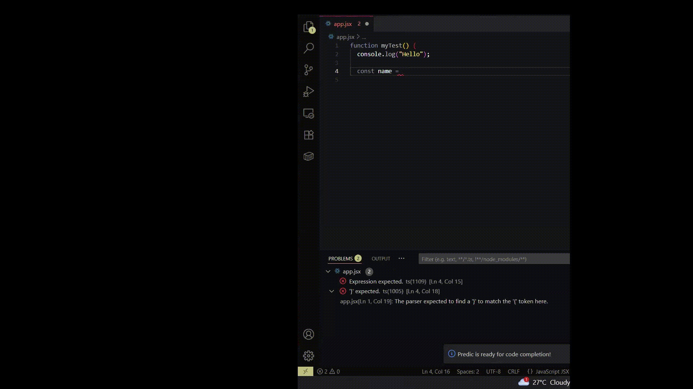

# 🔮 Predic: Your Offline & Private AI Coding Assistant

  

  <strong>The Private, Offline AI Coding Companion for VS Code.</strong>

**Predic** is a powerful AI coding assistant that runs 100% locally on your machine. It provides chat assistance, code explanation, and intelligent inline completions ("ghost text") without sending a single line of your code to the cloud.

---

## ✨ Why Predic?

-   **🔒 100% Privacy**: Your code never leaves your device. Ideal for enterprise or sensitive projects.
-   **⚡ Offline Capable**: Works perfectly without an internet connection (after initial model download).
-   **🧠 Bring Your Own Model**: Compatible with any GGUF model supported by [KoboldCpp](https://github.com/LostRuins/koboldcpp) (Qwen, DeepSeek, Llama 3, Phi-3).
-   **💰 Free**: No subscription fees. You own the compute.

## 🚀 Features

### 💬 Context-Aware Chat
Chat with your codebase naturally.
-   **Smart Context**: Type `@filename` to instantly add a file's content to the AI's context window.
-   **Streaming Responses**: Real-time, typewriter-style generation.
-   **Pro UI**: Clean, native VS Code interface with syntax highlighting, copy/edit/insert actions, and file chips.

### 👻 Inline Code Completion
Get "Ghost Text" suggestions as you type in the editor.
-   **FIM Support**: Uses "Fill-In-the-Middle" technology to understand code *before* and *after* your cursor.
-   **Low Latency**: Optimized for speed on consumer hardware.

### 🎛️ Model Dashboard
A dedicated control center for your AI.
-   **Model Manager**: Download curated high-performance coding models (like Qwen 2.5-Coder) directly from the UI.
-   **One-Click Switch**: Instantly swap between different models for different tasks (e.g., a small model for speed, a large model for complex logic).
-   **Official Models**: Try **ReaComplete**, our fine-tuned model optimized for React/TypeScript.

### 🛠️ Productivity Tools
-   **Explain Code**: Right-click any selection > `Predic: Explain Selection`.
-   **Fix Errors**: Right-click > `Predic: Fix Error`.

## 📦 Requirements

Since Predic runs locally, your hardware matters:
-   **OS**: Windows, macOS, or Linux.
-   **RAM**: Minimum 8GB (for small models), 16GB+ recommended.
-   **GPU (Optional)**: NVIDIA GPU with 6GB+ VRAM is highly recommended for faster response times.

## 🔧 Setup Guide

1.  **Install the Extension** from the VS Code Marketplace.
2.  **Download the Engine**:
    -   Predic relies on **KoboldCpp** to run models.
    -   Download the latest `koboldcpp` executable from [here](https://github.com/LostRuins/koboldcpp/releases).
3.  **Open the Dashboard**:
    -   Click the **Predic Icon** in the Activity Bar.
    -   Click the **Settings/Gear Icon** in the Chat header.
    -   Point Predic to your `koboldcpp.exe` (or binary).
4.  **Download a Model**:
    -   In the Dashboard, click **Download** on one of the "Recommended Models" (e.g., Qwen 2.5 Coder 1.5B).
5.  **Start Coding**:
    -   Click **Load** on your downloaded model.
    -   Go back to the Chat tab and say "Hello!".

## ⚙️ Extension Settings

You can configure Predic in VS Code Settings (`Ctrl+,`):

| Setting | Description |
| :--- | :--- |
| `predic.koboldCppPath` | Full path to your `koboldcpp` executable. |
| `predic.modelDir` | Folder where your `.gguf` models are stored. |
| `predic.gpuLayers` | Number of model layers to offload to your GPU (`-1` for auto). |
| `predic.contextSize` | Maximum context window in tokens (Default: `8192`). |
| `predic.port` | Local server port (Default: `5001`). |

## 🤝 Contributing

Predic is open source! We welcome issues, feature requests, and pull requests.
Check out our [GitHub Repository](https://github.com/Sayemahamed/Predic).

## 📄 License

[MIT License](LICENSE)

---

## 🙏 Acknowledgements

* A huge thank you to the team behind [koboldcpp](https://github.com/https://github.com/LostRuins/koboldcpp) for making local, in-browser, and in-app AI accessible to everyone.
